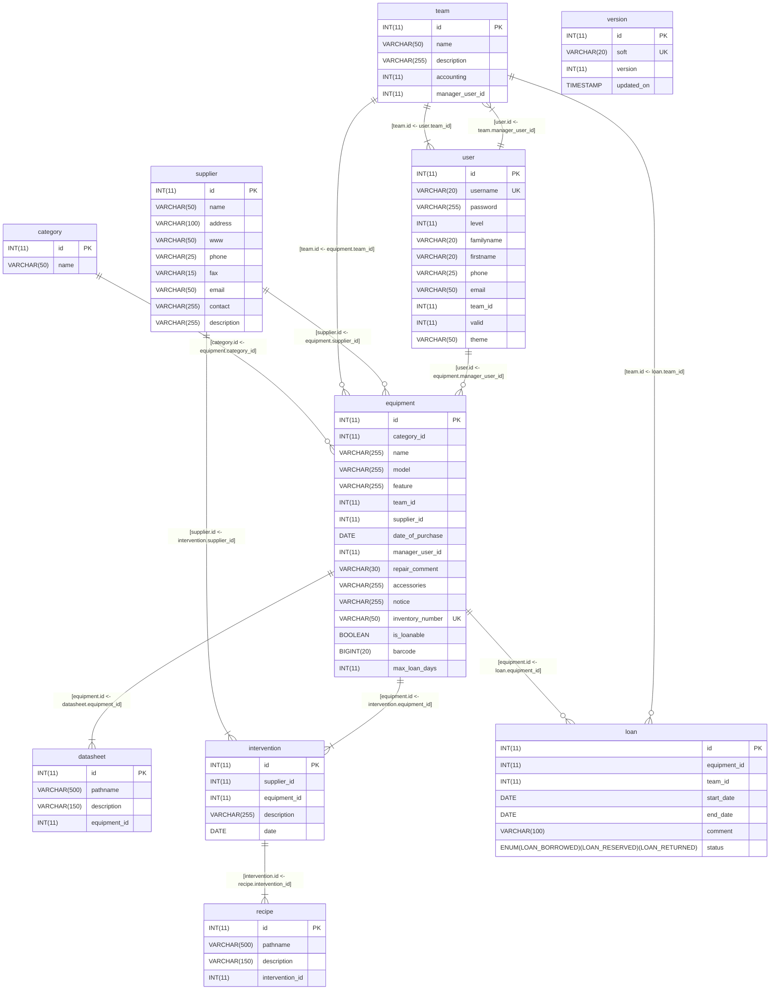

# GestEx - Gestion des Expérimentations

## Inventaire du matériel instrumentation

Ce sont des scripts écrit en PHP liés à un gestionnaire de bases de données MariaDB (MySQL).
Cet inventaire affiche une liste du matériel instrumentation.
Il est cependant possible d'avoir un inventaire d'autres matériels (informatique par exemple).

Le tri se fait par catégorie d'appareil.
On peut également afficher la liste globale des appareils. 
Pour chaque appareil est indiqué le modèle, le fournisseur, la gamme d'utilisation,
l'équipe propriétaire de l'appareil et une notice au format PDF. 
Si on clique sur le nom de l'appareil,
on fait apparaître des renseignements complémentaires comme :
 * la date d'achat,
 * les accessoires,
 * les réparations et/ou les étalonnages,
 * le technicien responsable,
 * le numéro d'inventaire si cet appareil a une somme supérieure à 800 euros.

Il apparaît également le numéro de l'instrument qui est incrémenté dans la liste
et que l'on retrouve sur l'appareil sous la forme d'une étiquette du type : LEGI équipe N° d'instrument.

## Sources GIT

### Git global setup

```bash
git config --global user.name "Prénom Nom-de-Famille"
git config --global user.email "Prénom.Nom-de-Famille@univ-grenoble-alpes.fr"
```

### Create a new repository

```bash
git clone git@gricad-gitlab.univ-grenoble-alpes.fr:legi/soft/gestex.git
cd gestex
touch README.md
git add README.md
git difftool
git commit README.md # -m "add README"
git push -u origin master
```
Il est préférable de toujours mettre le nom des fichiers que l'on commit.
Le message est à mettre de préférence dans l'éditeur
(`vi` par exemple),
ce qui permet de vérifier le commit et de l'annuler.

### Mise à jour de l'application sur le serveur web

On ne développe plus l'application directement sur le serveur,
ni on ne fait de copie externe.
L'idée est de passer par une mise à jour (update) du repository.
C'est un peu lourd mais c'est un mal nécessaire afin d'avoir enfin une vue un peu historique et globale dans le temps.

On se connecte au serveur,
puis les sources sont synchronisées et pousser dans le bon dossier.

```bash
# Première fois
git clone https://gricad-gitlab.univ-grenoble-alpes.fr/legi/soft/gestex.git

# Ensuite (retirer l'option dry-run après validation visuelle)
git pull
sudo rsync -av --delete --dry-run \
  --exclude connect.php --exclude data --exclude old \
  --exclude .git --exclude .gitignore \
  --exclude Makefile --exclude make-package-debian \
  gestex/ /var/www/gestex/
sudo chown -R www-data:www-data /var/www/gestex/
```

Une procédure plus performante et simple est possible via un paquet Debian, mais celle-ci n'a pas été complètement testée.
Chaque chose en son temps !


### Base de donnée

#### Installation

```bash
mysql -u root -p
CREATE DATABASE gestex
  DEFAULT CHARACTER SET utf8mb4
  COLLATE utf8mb4_unicode_ci;

CREATE USER 'gestex-server'@'localhost' IDENTIFIED BY 'ZZZZZZZZZ';
GRANT ALL PRIVILEGES ON gestex . * TO 'gestex-server'@'localhost';
FLUSH PRIVILEGES;
QUIT;

mysql -u root -p gestex < db-schema.sql
```

#### Mot de passe

Les commandes suivantes sont une aide pour générer le premier mot de passe,
ainsi que pour mettre manuellement un nouveau mot de passe à une personne au cas ou la système serait bloqué !

```bash
echo -n XXXXXXXXX | md5sum

mysql -u root -p gestex
INSERT INTO `user`(`id`, `username`, `password`, `level`, `familyname`, `firstname`, `phone`, `email`, `team_id`, `valid`) VALUES (1,'sys-admin','YYYYYYYYYYYYYYYYY',5,'Sys','Admin',0,0,0,1);
QUIT;

mysql -u root -p gestex
UPDATE users SET password='YYYYYYYYYYYYYYYYY'  WHERE id='1';
QUIT;
```

#### Sauvegarde de la base de donnée

On sauve la base de donnée dans un fichier portant la date du jour.
```bash
mysqldump -u root -p gestex > db-gestex-dump-$(date '+%Y%m%d').sql

# Without the CREATE DATABASE
mysqldump -u root -p --default-character-set=utf8mb4 --no-create-db gestex > db-gestex-dump-$(date '+%Y%m%d').sql
```

Pour récupérer la base de donnée ainsi sauvée,
il suffit de faire l'inverse.
Attention cependant que cette opération va annuler toutes les opérations qui auront été faites entre temps...
```bash
mysql -u root -p gestex < db-gestex-dump-YYYYMMDD.sql
```

Pour ne récupérer que le schéma de la base de donnée
```bash
mysqldump --no-data --lock-tables=false  -u pool -p pool  | grep -v '^/\*!' \
  | sed -e 's/ int(/ INT(/; s/ bigint(/ BIGINT(/; s/ char(/ CHAR(/; s/ varchar(/ VARCHAR(/;
            s/ boolean / BOOLEAN /; s/ date / DATE /; s/ text / TEXT /;
            s/ timestamp / TIMESTAMP /; s/ enum(/ ENUM(/;
            s/ AUTO_INCREMENT=[[:digit:]]* / AUTO_INCREMENT=1 /;
            s/ current_timestamp()/ CURRENT_TIMESTAMP/g;' \
  > db-schema-dump-$(date '+%Y%m%d').sql
```

Il est possible de comparer alors ce schéma avec le schéma officiel
(intéressant s'il y a des soucis lors des mises à jour de schéma)...
```bash
meld db-schema.sql db-schema-dump-$(date '+%Y%m%d').sql
```

#### Mise à jour de la base de donnée

Pour connaître la version du schéma nécessaire dans le code
et la version du schéma actuellement utilisé par la base de donnée.
```bash
grep 'define.*GESTEX_DB_VERSION' module/*.php

mysql -u root -p gestex
SELECT * FROM version WHERE soft = 'database';
```

Par exemple, pour passer de la version 3 à la version 4 du schéma
```bash
mysql -u root -p gestex < db-upgrade-3-4.sql
```

#### Schéma de la base



```dot
digraph schema {

   graph [rankdir=LR, splines=polyline, nodesep=0.6, ranksep=1.0];
   node [shape=plain, fontname="DejaVu Sans Mono", margin=0];
   edge [fontname="DejaVu Sans Mono", fontsize=9];

   "category" [
      label=<
         <TABLE BORDER="1" CELLBORDER="0" CELLSPACING="0" CELLPADDING="0">
            <TR>
               <TD BGCOLOR="#4F81BD" CELLPADDING="6"><FONT FACE="Arial" COLOR="white"><B>category</B></FONT></TD>
            </TR>
            <TR>
               <TD PORT="category__id" CELLPADDING="0">
                  <TABLE BORDER="0" CELLBORDER="1" CELLSPACING="0" CELLPADDING="4">
                     <TR>
                        <TD WIDTH="64" ALIGN="LEFT" BGCOLOR="#FFF2CC"><FONT FACE="DejaVu Sans Mono"><B>id</B></FONT></TD>
                        <TD WIDTH="112" ALIGN="LEFT" BGCOLOR="#FFF2CC"><FONT FACE="DejaVu Sans Mono" COLOR="#555555">INT(11)</FONT></TD>
                        <TD WIDTH="48" ALIGN="CENTER" BGCOLOR="#FFD966"><FONT FACE="DejaVu Sans Mono"><B>PK</B></FONT></TD>
                     </TR>
                  </TABLE>
               </TD>
            </TR>
            <TR>
               <TD PORT="category__name" CELLPADDING="0">
                  <TABLE BORDER="0" CELLBORDER="1" CELLSPACING="0" CELLPADDING="4">
                     <TR>
                        <TD WIDTH="64" ALIGN="LEFT" BGCOLOR="#FFFFFF"><FONT FACE="DejaVu Sans Mono">name</FONT></TD>
                        <TD WIDTH="112" ALIGN="LEFT" BGCOLOR="#FFFFFF"><FONT FACE="DejaVu Sans Mono" COLOR="#555555">VARCHAR(50)</FONT></TD>
                        <TD WIDTH="48" ALIGN="CENTER" BGCOLOR="#FFFFFF"> </TD>
                     </TR>
                  </TABLE>
               </TD>
            </TR>
         </TABLE>
      >
   ];

   "datasheet" [
      label=<
         <TABLE BORDER="1" CELLBORDER="0" CELLSPACING="0" CELLPADDING="0">
            <TR>
               <TD BGCOLOR="#4F81BD" CELLPADDING="6"><FONT FACE="Arial" COLOR="white"><B>datasheet</B></FONT></TD>
            </TR>
            <TR>
               <TD PORT="datasheet__id" CELLPADDING="0">
                  <TABLE BORDER="0" CELLBORDER="1" CELLSPACING="0" CELLPADDING="4">
                     <TR>
                        <TD WIDTH="120" ALIGN="LEFT" BGCOLOR="#FFF2CC"><FONT FACE="DejaVu Sans Mono"><B>id</B></FONT></TD>
                        <TD WIDTH="120" ALIGN="LEFT" BGCOLOR="#FFF2CC"><FONT FACE="DejaVu Sans Mono" COLOR="#555555">INT(11)</FONT></TD>
                        <TD WIDTH="48" ALIGN="CENTER" BGCOLOR="#FFD966"><FONT FACE="DejaVu Sans Mono"><B>PK</B></FONT></TD>
                     </TR>
                  </TABLE>
               </TD>
            </TR>
            <TR>
               <TD PORT="datasheet__pathname" CELLPADDING="0">
                  <TABLE BORDER="0" CELLBORDER="1" CELLSPACING="0" CELLPADDING="4">
                     <TR>
                        <TD WIDTH="120" ALIGN="LEFT" BGCOLOR="#FFFFFF"><FONT FACE="DejaVu Sans Mono">pathname</FONT></TD>
                        <TD WIDTH="120" ALIGN="LEFT" BGCOLOR="#FFFFFF"><FONT FACE="DejaVu Sans Mono" COLOR="#555555">VARCHAR(500)</FONT></TD>
                        <TD WIDTH="48" ALIGN="CENTER" BGCOLOR="#FFFFFF"> </TD>
                     </TR>
                  </TABLE>
               </TD>
            </TR>
            <TR>
               <TD PORT="datasheet__description" CELLPADDING="0">
                  <TABLE BORDER="0" CELLBORDER="1" CELLSPACING="0" CELLPADDING="4">
                     <TR>
                        <TD WIDTH="120" ALIGN="LEFT" BGCOLOR="#FFFFFF"><FONT FACE="DejaVu Sans Mono">description</FONT></TD>
                        <TD WIDTH="120" ALIGN="LEFT" BGCOLOR="#FFFFFF"><FONT FACE="DejaVu Sans Mono" COLOR="#555555">VARCHAR(150)</FONT></TD>
                        <TD WIDTH="48" ALIGN="CENTER" BGCOLOR="#FFFFFF"> </TD>
                     </TR>
                  </TABLE>
               </TD>
            </TR>
            <TR>
               <TD PORT="datasheet__equipment_id" CELLPADDING="0">
                  <TABLE BORDER="0" CELLBORDER="1" CELLSPACING="0" CELLPADDING="4">
                     <TR>
                        <TD WIDTH="120" ALIGN="LEFT" BGCOLOR="#DDEBF7"><FONT FACE="DejaVu Sans Mono">equipment_id</FONT></TD>
                        <TD WIDTH="120" ALIGN="LEFT" BGCOLOR="#DDEBF7"><FONT FACE="DejaVu Sans Mono" COLOR="#555555">INT(11)</FONT></TD>
                        <TD WIDTH="48" ALIGN="CENTER" BGCOLOR="#9DC3E6"><FONT FACE="DejaVu Sans Mono"><B>FK</B></FONT></TD>
                     </TR>
                  </TABLE>
               </TD>
            </TR>
         </TABLE>
      >
   ];

   "equipment" [
      label=<
         <TABLE BORDER="1" CELLBORDER="0" CELLSPACING="0" CELLPADDING="0">
            <TR>
               <TD BGCOLOR="#4F81BD" CELLPADDING="6"><FONT FACE="Arial" COLOR="white"><B>equipment</B></FONT></TD>
            </TR>
            <TR>
               <TD PORT="equipment__id" CELLPADDING="0">
                  <TABLE BORDER="0" CELLBORDER="1" CELLSPACING="0" CELLPADDING="4">
                     <TR>
                        <TD WIDTH="152" ALIGN="LEFT" BGCOLOR="#FFF2CC"><FONT FACE="DejaVu Sans Mono"><B>id</B></FONT></TD>
                        <TD WIDTH="120" ALIGN="LEFT" BGCOLOR="#FFF2CC"><FONT FACE="DejaVu Sans Mono" COLOR="#555555">INT(11)</FONT></TD>
                        <TD WIDTH="48" ALIGN="CENTER" BGCOLOR="#FFD966"><FONT FACE="DejaVu Sans Mono"><B>PK</B></FONT></TD>
                     </TR>
                  </TABLE>
               </TD>
            </TR>
            <TR>
               <TD PORT="equipment__category_id" CELLPADDING="0">
                  <TABLE BORDER="0" CELLBORDER="1" CELLSPACING="0" CELLPADDING="4">
                     <TR>
                        <TD WIDTH="152" ALIGN="LEFT" BGCOLOR="#DDEBF7"><FONT FACE="DejaVu Sans Mono">category_id</FONT></TD>
                        <TD WIDTH="120" ALIGN="LEFT" BGCOLOR="#DDEBF7"><FONT FACE="DejaVu Sans Mono" COLOR="#555555">INT(11)</FONT></TD>
                        <TD WIDTH="48" ALIGN="CENTER" BGCOLOR="#9DC3E6"><FONT FACE="DejaVu Sans Mono"><B>FK</B></FONT></TD>
                     </TR>
                  </TABLE>
               </TD>
            </TR>
            <TR>
               <TD PORT="equipment__name" CELLPADDING="0">
                  <TABLE BORDER="0" CELLBORDER="1" CELLSPACING="0" CELLPADDING="4">
                     <TR>
                        <TD WIDTH="152" ALIGN="LEFT" BGCOLOR="#FFFFFF"><FONT FACE="DejaVu Sans Mono">name</FONT></TD>
                        <TD WIDTH="120" ALIGN="LEFT" BGCOLOR="#FFFFFF"><FONT FACE="DejaVu Sans Mono" COLOR="#555555">VARCHAR(255)</FONT></TD>
                        <TD WIDTH="48" ALIGN="CENTER" BGCOLOR="#FFFFFF"> </TD>
                     </TR>
                  </TABLE>
               </TD>
            </TR>
            <TR>
               <TD PORT="equipment__model" CELLPADDING="0">
                  <TABLE BORDER="0" CELLBORDER="1" CELLSPACING="0" CELLPADDING="4">
                     <TR>
                        <TD WIDTH="152" ALIGN="LEFT" BGCOLOR="#FFFFFF"><FONT FACE="DejaVu Sans Mono">model</FONT></TD>
                        <TD WIDTH="120" ALIGN="LEFT" BGCOLOR="#FFFFFF"><FONT FACE="DejaVu Sans Mono" COLOR="#555555">VARCHAR(255)</FONT></TD>
                        <TD WIDTH="48" ALIGN="CENTER" BGCOLOR="#FFFFFF"> </TD>
                     </TR>
                  </TABLE>
               </TD>
            </TR>
            <TR>
               <TD PORT="equipment__feature" CELLPADDING="0">
                  <TABLE BORDER="0" CELLBORDER="1" CELLSPACING="0" CELLPADDING="4">
                     <TR>
                        <TD WIDTH="152" ALIGN="LEFT" BGCOLOR="#FFFFFF"><FONT FACE="DejaVu Sans Mono">feature</FONT></TD>
                        <TD WIDTH="120" ALIGN="LEFT" BGCOLOR="#FFFFFF"><FONT FACE="DejaVu Sans Mono" COLOR="#555555">VARCHAR(255)</FONT></TD>
                        <TD WIDTH="48" ALIGN="CENTER" BGCOLOR="#FFFFFF"> </TD>
                     </TR>
                  </TABLE>
               </TD>
            </TR>
            <TR>
               <TD PORT="equipment__team_id" CELLPADDING="0">
                  <TABLE BORDER="0" CELLBORDER="1" CELLSPACING="0" CELLPADDING="4">
                     <TR>
                        <TD WIDTH="152" ALIGN="LEFT" BGCOLOR="#DDEBF7"><FONT FACE="DejaVu Sans Mono">team_id</FONT></TD>
                        <TD WIDTH="120" ALIGN="LEFT" BGCOLOR="#DDEBF7"><FONT FACE="DejaVu Sans Mono" COLOR="#555555">INT(11)</FONT></TD>
                        <TD WIDTH="48" ALIGN="CENTER" BGCOLOR="#9DC3E6"><FONT FACE="DejaVu Sans Mono"><B>FK</B></FONT></TD>
                     </TR>
                  </TABLE>
               </TD>
            </TR>
            <TR>
               <TD PORT="equipment__supplier_id" CELLPADDING="0">
                  <TABLE BORDER="0" CELLBORDER="1" CELLSPACING="0" CELLPADDING="4">
                     <TR>
                        <TD WIDTH="152" ALIGN="LEFT" BGCOLOR="#DDEBF7"><FONT FACE="DejaVu Sans Mono">supplier_id</FONT></TD>
                        <TD WIDTH="120" ALIGN="LEFT" BGCOLOR="#DDEBF7"><FONT FACE="DejaVu Sans Mono" COLOR="#555555">INT(11)</FONT></TD>
                        <TD WIDTH="48" ALIGN="CENTER" BGCOLOR="#9DC3E6"><FONT FACE="DejaVu Sans Mono"><B>FK</B></FONT></TD>
                     </TR>
                  </TABLE>
               </TD>
            </TR>
            <TR>
               <TD PORT="equipment__date_of_purchase" CELLPADDING="0">
                  <TABLE BORDER="0" CELLBORDER="1" CELLSPACING="0" CELLPADDING="4">
                     <TR>
                        <TD WIDTH="152" ALIGN="LEFT" BGCOLOR="#FFFFFF"><FONT FACE="DejaVu Sans Mono">date_of_purchase</FONT></TD>
                        <TD WIDTH="120" ALIGN="LEFT" BGCOLOR="#FFFFFF"><FONT FACE="DejaVu Sans Mono" COLOR="#555555">DATE</FONT></TD>
                        <TD WIDTH="48" ALIGN="CENTER" BGCOLOR="#FFFFFF"> </TD>
                     </TR>
                  </TABLE>
               </TD>
            </TR>
            <TR>
               <TD PORT="equipment__manager_user_id" CELLPADDING="0">
                  <TABLE BORDER="0" CELLBORDER="1" CELLSPACING="0" CELLPADDING="4">
                     <TR>
                        <TD WIDTH="152" ALIGN="LEFT" BGCOLOR="#DDEBF7"><FONT FACE="DejaVu Sans Mono">manager_user_id</FONT></TD>
                        <TD WIDTH="120" ALIGN="LEFT" BGCOLOR="#DDEBF7"><FONT FACE="DejaVu Sans Mono" COLOR="#555555">INT(11)</FONT></TD>
                        <TD WIDTH="48" ALIGN="CENTER" BGCOLOR="#9DC3E6"><FONT FACE="DejaVu Sans Mono"><B>FK</B></FONT></TD>
                     </TR>
                  </TABLE>
               </TD>
            </TR>
            <TR>
               <TD PORT="equipment__repair_comment" CELLPADDING="0">
                  <TABLE BORDER="0" CELLBORDER="1" CELLSPACING="0" CELLPADDING="4">
                     <TR>
                        <TD WIDTH="152" ALIGN="LEFT" BGCOLOR="#FFFFFF"><FONT FACE="DejaVu Sans Mono">repair_comment</FONT></TD>
                        <TD WIDTH="120" ALIGN="LEFT" BGCOLOR="#FFFFFF"><FONT FACE="DejaVu Sans Mono" COLOR="#555555">VARCHAR(30)</FONT></TD>
                        <TD WIDTH="48" ALIGN="CENTER" BGCOLOR="#FFFFFF"> </TD>
                     </TR>
                  </TABLE>
               </TD>
            </TR>
            <TR>
               <TD PORT="equipment__accessories" CELLPADDING="0">
                  <TABLE BORDER="0" CELLBORDER="1" CELLSPACING="0" CELLPADDING="4">
                     <TR>
                        <TD WIDTH="152" ALIGN="LEFT" BGCOLOR="#FFFFFF"><FONT FACE="DejaVu Sans Mono">accessories</FONT></TD>
                        <TD WIDTH="120" ALIGN="LEFT" BGCOLOR="#FFFFFF"><FONT FACE="DejaVu Sans Mono" COLOR="#555555">VARCHAR(255)</FONT></TD>
                        <TD WIDTH="48" ALIGN="CENTER" BGCOLOR="#FFFFFF"> </TD>
                     </TR>
                  </TABLE>
               </TD>
            </TR>
            <TR>
               <TD PORT="equipment__notice" CELLPADDING="0">
                  <TABLE BORDER="0" CELLBORDER="1" CELLSPACING="0" CELLPADDING="4">
                     <TR>
                        <TD WIDTH="152" ALIGN="LEFT" BGCOLOR="#FFFFFF"><FONT FACE="DejaVu Sans Mono">notice</FONT></TD>
                        <TD WIDTH="120" ALIGN="LEFT" BGCOLOR="#FFFFFF"><FONT FACE="DejaVu Sans Mono" COLOR="#555555">VARCHAR(255)</FONT></TD>
                        <TD WIDTH="48" ALIGN="CENTER" BGCOLOR="#FFFFFF"> </TD>
                     </TR>
                  </TABLE>
               </TD>
            </TR>
            <TR>
               <TD PORT="equipment__inventory_number" CELLPADDING="0">
                  <TABLE BORDER="0" CELLBORDER="1" CELLSPACING="0" CELLPADDING="4">
                     <TR>
                        <TD WIDTH="152" ALIGN="LEFT" BGCOLOR="#E2F0D9"><FONT FACE="DejaVu Sans Mono">inventory_number</FONT></TD>
                        <TD WIDTH="120" ALIGN="LEFT" BGCOLOR="#E2F0D9"><FONT FACE="DejaVu Sans Mono" COLOR="#555555">VARCHAR(50)</FONT></TD>
                        <TD WIDTH="48" ALIGN="CENTER" BGCOLOR="#A9D18E"><FONT FACE="DejaVu Sans Mono"><B>UK</B></FONT></TD>
                     </TR>
                  </TABLE>
               </TD>
            </TR>
            <TR>
               <TD PORT="equipment__is_loanable" CELLPADDING="0">
                  <TABLE BORDER="0" CELLBORDER="1" CELLSPACING="0" CELLPADDING="4">
                     <TR>
                        <TD WIDTH="152" ALIGN="LEFT" BGCOLOR="#FFFFFF"><FONT FACE="DejaVu Sans Mono">is_loanable</FONT></TD>
                        <TD WIDTH="120" ALIGN="LEFT" BGCOLOR="#FFFFFF"><FONT FACE="DejaVu Sans Mono" COLOR="#555555">BOOLEAN</FONT></TD>
                        <TD WIDTH="48" ALIGN="CENTER" BGCOLOR="#FFFFFF"> </TD>
                     </TR>
                  </TABLE>
               </TD>
            </TR>
            <TR>
               <TD PORT="equipment__barcode" CELLPADDING="0">
                  <TABLE BORDER="0" CELLBORDER="1" CELLSPACING="0" CELLPADDING="4">
                     <TR>
                        <TD WIDTH="152" ALIGN="LEFT" BGCOLOR="#FFFFFF"><FONT FACE="DejaVu Sans Mono">barcode</FONT></TD>
                        <TD WIDTH="120" ALIGN="LEFT" BGCOLOR="#FFFFFF"><FONT FACE="DejaVu Sans Mono" COLOR="#555555">BIGINT(20)</FONT></TD>
                        <TD WIDTH="48" ALIGN="CENTER" BGCOLOR="#FFFFFF"> </TD>
                     </TR>
                  </TABLE>
               </TD>
            </TR>
            <TR>
               <TD PORT="equipment__max_loan_days" CELLPADDING="0">
                  <TABLE BORDER="0" CELLBORDER="1" CELLSPACING="0" CELLPADDING="4">
                     <TR>
                        <TD WIDTH="152" ALIGN="LEFT" BGCOLOR="#FFFFFF"><FONT FACE="DejaVu Sans Mono">max_loan_days</FONT></TD>
                        <TD WIDTH="120" ALIGN="LEFT" BGCOLOR="#FFFFFF"><FONT FACE="DejaVu Sans Mono" COLOR="#555555">INT(11)</FONT></TD>
                        <TD WIDTH="48" ALIGN="CENTER" BGCOLOR="#FFFFFF"> </TD>
                     </TR>
                  </TABLE>
               </TD>
            </TR>
         </TABLE>
      >
   ];

   "intervention" [
      label=<
         <TABLE BORDER="1" CELLBORDER="0" CELLSPACING="0" CELLPADDING="0">
            <TR>
               <TD BGCOLOR="#4F81BD" CELLPADDING="6"><FONT FACE="Arial" COLOR="white"><B>intervention</B></FONT></TD>
            </TR>
            <TR>
               <TD PORT="intervention__id" CELLPADDING="0">
                  <TABLE BORDER="0" CELLBORDER="1" CELLSPACING="0" CELLPADDING="4">
                     <TR>
                        <TD WIDTH="120" ALIGN="LEFT" BGCOLOR="#FFF2CC"><FONT FACE="DejaVu Sans Mono"><B>id</B></FONT></TD>
                        <TD WIDTH="120" ALIGN="LEFT" BGCOLOR="#FFF2CC"><FONT FACE="DejaVu Sans Mono" COLOR="#555555">INT(11)</FONT></TD>
                        <TD WIDTH="48" ALIGN="CENTER" BGCOLOR="#FFD966"><FONT FACE="DejaVu Sans Mono"><B>PK</B></FONT></TD>
                     </TR>
                  </TABLE>
               </TD>
            </TR>
            <TR>
               <TD PORT="intervention__supplier_id" CELLPADDING="0">
                  <TABLE BORDER="0" CELLBORDER="1" CELLSPACING="0" CELLPADDING="4">
                     <TR>
                        <TD WIDTH="120" ALIGN="LEFT" BGCOLOR="#DDEBF7"><FONT FACE="DejaVu Sans Mono">supplier_id</FONT></TD>
                        <TD WIDTH="120" ALIGN="LEFT" BGCOLOR="#DDEBF7"><FONT FACE="DejaVu Sans Mono" COLOR="#555555">INT(11)</FONT></TD>
                        <TD WIDTH="48" ALIGN="CENTER" BGCOLOR="#9DC3E6"><FONT FACE="DejaVu Sans Mono"><B>FK</B></FONT></TD>
                     </TR>
                  </TABLE>
               </TD>
            </TR>
            <TR>
               <TD PORT="intervention__equipment_id" CELLPADDING="0">
                  <TABLE BORDER="0" CELLBORDER="1" CELLSPACING="0" CELLPADDING="4">
                     <TR>
                        <TD WIDTH="120" ALIGN="LEFT" BGCOLOR="#DDEBF7"><FONT FACE="DejaVu Sans Mono">equipment_id</FONT></TD>
                        <TD WIDTH="120" ALIGN="LEFT" BGCOLOR="#DDEBF7"><FONT FACE="DejaVu Sans Mono" COLOR="#555555">INT(11)</FONT></TD>
                        <TD WIDTH="48" ALIGN="CENTER" BGCOLOR="#9DC3E6"><FONT FACE="DejaVu Sans Mono"><B>FK</B></FONT></TD>
                     </TR>
                  </TABLE>
               </TD>
            </TR>
            <TR>
               <TD PORT="intervention__description" CELLPADDING="0">
                  <TABLE BORDER="0" CELLBORDER="1" CELLSPACING="0" CELLPADDING="4">
                     <TR>
                        <TD WIDTH="120" ALIGN="LEFT" BGCOLOR="#FFFFFF"><FONT FACE="DejaVu Sans Mono">description</FONT></TD>
                        <TD WIDTH="120" ALIGN="LEFT" BGCOLOR="#FFFFFF"><FONT FACE="DejaVu Sans Mono" COLOR="#555555">VARCHAR(255)</FONT></TD>
                        <TD WIDTH="48" ALIGN="CENTER" BGCOLOR="#FFFFFF"> </TD>
                     </TR>
                  </TABLE>
               </TD>
            </TR>
            <TR>
               <TD PORT="intervention__date" CELLPADDING="0">
                  <TABLE BORDER="0" CELLBORDER="1" CELLSPACING="0" CELLPADDING="4">
                     <TR>
                        <TD WIDTH="120" ALIGN="LEFT" BGCOLOR="#FFFFFF"><FONT FACE="DejaVu Sans Mono">date</FONT></TD>
                        <TD WIDTH="120" ALIGN="LEFT" BGCOLOR="#FFFFFF"><FONT FACE="DejaVu Sans Mono" COLOR="#555555">DATE</FONT></TD>
                        <TD WIDTH="48" ALIGN="CENTER" BGCOLOR="#FFFFFF"> </TD>
                     </TR>
                  </TABLE>
               </TD>
            </TR>
         </TABLE>
      >
   ];

   "loan" [
      label=<
         <TABLE BORDER="1" CELLBORDER="0" CELLSPACING="0" CELLPADDING="0">
            <TR>
               <TD BGCOLOR="#4F81BD" CELLPADDING="6"><FONT FACE="Arial" COLOR="white"><B>loan</B></FONT></TD>
            </TR>
            <TR>
               <TD PORT="loan__id" CELLPADDING="0">
                  <TABLE BORDER="0" CELLBORDER="1" CELLSPACING="0" CELLPADDING="4">
                     <TR>
                        <TD WIDTH="120" ALIGN="LEFT" BGCOLOR="#FFF2CC"><FONT FACE="DejaVu Sans Mono"><B>id</B></FONT></TD>
                        <TD WIDTH="400" ALIGN="LEFT" BGCOLOR="#FFF2CC"><FONT FACE="DejaVu Sans Mono" COLOR="#555555">INT(11)</FONT></TD>
                        <TD WIDTH="48" ALIGN="CENTER" BGCOLOR="#FFD966"><FONT FACE="DejaVu Sans Mono"><B>PK</B></FONT></TD>
                     </TR>
                  </TABLE>
               </TD>
            </TR>
            <TR>
               <TD PORT="loan__equipment_id" CELLPADDING="0">
                  <TABLE BORDER="0" CELLBORDER="1" CELLSPACING="0" CELLPADDING="4">
                     <TR>
                        <TD WIDTH="120" ALIGN="LEFT" BGCOLOR="#DDEBF7"><FONT FACE="DejaVu Sans Mono">equipment_id</FONT></TD>
                        <TD WIDTH="400" ALIGN="LEFT" BGCOLOR="#DDEBF7"><FONT FACE="DejaVu Sans Mono" COLOR="#555555">INT(11)</FONT></TD>
                        <TD WIDTH="48" ALIGN="CENTER" BGCOLOR="#9DC3E6"><FONT FACE="DejaVu Sans Mono"><B>FK</B></FONT></TD>
                     </TR>
                  </TABLE>
               </TD>
            </TR>
            <TR>
               <TD PORT="loan__team_id" CELLPADDING="0">
                  <TABLE BORDER="0" CELLBORDER="1" CELLSPACING="0" CELLPADDING="4">
                     <TR>
                        <TD WIDTH="120" ALIGN="LEFT" BGCOLOR="#DDEBF7"><FONT FACE="DejaVu Sans Mono">team_id</FONT></TD>
                        <TD WIDTH="400" ALIGN="LEFT" BGCOLOR="#DDEBF7"><FONT FACE="DejaVu Sans Mono" COLOR="#555555">INT(11)</FONT></TD>
                        <TD WIDTH="48" ALIGN="CENTER" BGCOLOR="#9DC3E6"><FONT FACE="DejaVu Sans Mono"><B>FK</B></FONT></TD>
                     </TR>
                  </TABLE>
               </TD>
            </TR>
            <TR>
               <TD PORT="loan__start_date" CELLPADDING="0">
                  <TABLE BORDER="0" CELLBORDER="1" CELLSPACING="0" CELLPADDING="4">
                     <TR>
                        <TD WIDTH="120" ALIGN="LEFT" BGCOLOR="#FFFFFF"><FONT FACE="DejaVu Sans Mono">start_date</FONT></TD>
                        <TD WIDTH="400" ALIGN="LEFT" BGCOLOR="#FFFFFF"><FONT FACE="DejaVu Sans Mono" COLOR="#555555">DATE</FONT></TD>
                        <TD WIDTH="48" ALIGN="CENTER" BGCOLOR="#FFFFFF"> </TD>
                     </TR>
                  </TABLE>
               </TD>
            </TR>
            <TR>
               <TD PORT="loan__end_date" CELLPADDING="0">
                  <TABLE BORDER="0" CELLBORDER="1" CELLSPACING="0" CELLPADDING="4">
                     <TR>
                        <TD WIDTH="120" ALIGN="LEFT" BGCOLOR="#FFFFFF"><FONT FACE="DejaVu Sans Mono">end_date</FONT></TD>
                        <TD WIDTH="400" ALIGN="LEFT" BGCOLOR="#FFFFFF"><FONT FACE="DejaVu Sans Mono" COLOR="#555555">DATE</FONT></TD>
                        <TD WIDTH="48" ALIGN="CENTER" BGCOLOR="#FFFFFF"> </TD>
                     </TR>
                  </TABLE>
               </TD>
            </TR>
            <TR>
               <TD PORT="loan__comment" CELLPADDING="0">
                  <TABLE BORDER="0" CELLBORDER="1" CELLSPACING="0" CELLPADDING="4">
                     <TR>
                        <TD WIDTH="120" ALIGN="LEFT" BGCOLOR="#FFFFFF"><FONT FACE="DejaVu Sans Mono">comment</FONT></TD>
                        <TD WIDTH="400" ALIGN="LEFT" BGCOLOR="#FFFFFF"><FONT FACE="DejaVu Sans Mono" COLOR="#555555">VARCHAR(100)</FONT></TD>
                        <TD WIDTH="48" ALIGN="CENTER" BGCOLOR="#FFFFFF"> </TD>
                     </TR>
                  </TABLE>
               </TD>
            </TR>
            <TR>
               <TD PORT="loan__status" CELLPADDING="0">
                  <TABLE BORDER="0" CELLBORDER="1" CELLSPACING="0" CELLPADDING="4">
                     <TR>
                        <TD WIDTH="120" ALIGN="LEFT" BGCOLOR="#FFFFFF"><FONT FACE="DejaVu Sans Mono">status</FONT></TD>
                        <TD WIDTH="400" ALIGN="LEFT" BGCOLOR="#FFFFFF"><FONT FACE="DejaVu Sans Mono" COLOR="#555555">ENUM(LOAN_BORROWED,LOAN_RESERVED,LOAN_RETURNED)</FONT></TD>
                        <TD WIDTH="48" ALIGN="CENTER" BGCOLOR="#FFFFFF"> </TD>
                     </TR>
                  </TABLE>
               </TD>
            </TR>
         </TABLE>
      >
   ];

   "recipe" [
      label=<
         <TABLE BORDER="1" CELLBORDER="0" CELLSPACING="0" CELLPADDING="0">
            <TR>
               <TD BGCOLOR="#4F81BD" CELLPADDING="6"><FONT FACE="Arial" COLOR="white"><B>recipe</B></FONT></TD>
            </TR>
            <TR>
               <TD PORT="recipe__id" CELLPADDING="0">
                  <TABLE BORDER="0" CELLBORDER="1" CELLSPACING="0" CELLPADDING="4">
                     <TR>
                        <TD WIDTH="144" ALIGN="LEFT" BGCOLOR="#FFF2CC"><FONT FACE="DejaVu Sans Mono"><B>id</B></FONT></TD>
                        <TD WIDTH="120" ALIGN="LEFT" BGCOLOR="#FFF2CC"><FONT FACE="DejaVu Sans Mono" COLOR="#555555">INT(11)</FONT></TD>
                        <TD WIDTH="48" ALIGN="CENTER" BGCOLOR="#FFD966"><FONT FACE="DejaVu Sans Mono"><B>PK</B></FONT></TD>
                     </TR>
                  </TABLE>
               </TD>
            </TR>
            <TR>
               <TD PORT="recipe__pathname" CELLPADDING="0">
                  <TABLE BORDER="0" CELLBORDER="1" CELLSPACING="0" CELLPADDING="4">
                     <TR>
                        <TD WIDTH="144" ALIGN="LEFT" BGCOLOR="#FFFFFF"><FONT FACE="DejaVu Sans Mono">pathname</FONT></TD>
                        <TD WIDTH="120" ALIGN="LEFT" BGCOLOR="#FFFFFF"><FONT FACE="DejaVu Sans Mono" COLOR="#555555">VARCHAR(500)</FONT></TD>
                        <TD WIDTH="48" ALIGN="CENTER" BGCOLOR="#FFFFFF"> </TD>
                     </TR>
                  </TABLE>
               </TD>
            </TR>
            <TR>
               <TD PORT="recipe__description" CELLPADDING="0">
                  <TABLE BORDER="0" CELLBORDER="1" CELLSPACING="0" CELLPADDING="4">
                     <TR>
                        <TD WIDTH="144" ALIGN="LEFT" BGCOLOR="#FFFFFF"><FONT FACE="DejaVu Sans Mono">description</FONT></TD>
                        <TD WIDTH="120" ALIGN="LEFT" BGCOLOR="#FFFFFF"><FONT FACE="DejaVu Sans Mono" COLOR="#555555">VARCHAR(150)</FONT></TD>
                        <TD WIDTH="48" ALIGN="CENTER" BGCOLOR="#FFFFFF"> </TD>
                     </TR>
                  </TABLE>
               </TD>
            </TR>
            <TR>
               <TD PORT="recipe__intervention_id" CELLPADDING="0">
                  <TABLE BORDER="0" CELLBORDER="1" CELLSPACING="0" CELLPADDING="4">
                     <TR>
                        <TD WIDTH="144" ALIGN="LEFT" BGCOLOR="#DDEBF7"><FONT FACE="DejaVu Sans Mono">intervention_id</FONT></TD>
                        <TD WIDTH="120" ALIGN="LEFT" BGCOLOR="#DDEBF7"><FONT FACE="DejaVu Sans Mono" COLOR="#555555">INT(11)</FONT></TD>
                        <TD WIDTH="48" ALIGN="CENTER" BGCOLOR="#9DC3E6"><FONT FACE="DejaVu Sans Mono"><B>FK</B></FONT></TD>
                     </TR>
                  </TABLE>
               </TD>
            </TR>
         </TABLE>
      >
   ];

   "supplier" [
      label=<
         <TABLE BORDER="1" CELLBORDER="0" CELLSPACING="0" CELLPADDING="0">
            <TR>
               <TD BGCOLOR="#4F81BD" CELLPADDING="6"><FONT FACE="Arial" COLOR="white"><B>supplier</B></FONT></TD>
            </TR>
            <TR>
               <TD PORT="supplier__id" CELLPADDING="0">
                  <TABLE BORDER="0" CELLBORDER="1" CELLSPACING="0" CELLPADDING="4">
                     <TR>
                        <TD WIDTH="112" ALIGN="LEFT" BGCOLOR="#FFF2CC"><FONT FACE="DejaVu Sans Mono"><B>id</B></FONT></TD>
                        <TD WIDTH="120" ALIGN="LEFT" BGCOLOR="#FFF2CC"><FONT FACE="DejaVu Sans Mono" COLOR="#555555">INT(11)</FONT></TD>
                        <TD WIDTH="48" ALIGN="CENTER" BGCOLOR="#FFD966"><FONT FACE="DejaVu Sans Mono"><B>PK</B></FONT></TD>
                     </TR>
                  </TABLE>
               </TD>
            </TR>
            <TR>
               <TD PORT="supplier__name" CELLPADDING="0">
                  <TABLE BORDER="0" CELLBORDER="1" CELLSPACING="0" CELLPADDING="4">
                     <TR>
                        <TD WIDTH="112" ALIGN="LEFT" BGCOLOR="#FFFFFF"><FONT FACE="DejaVu Sans Mono">name</FONT></TD>
                        <TD WIDTH="120" ALIGN="LEFT" BGCOLOR="#FFFFFF"><FONT FACE="DejaVu Sans Mono" COLOR="#555555">VARCHAR(50)</FONT></TD>
                        <TD WIDTH="48" ALIGN="CENTER" BGCOLOR="#FFFFFF"> </TD>
                     </TR>
                  </TABLE>
               </TD>
            </TR>
            <TR>
               <TD PORT="supplier__address" CELLPADDING="0">
                  <TABLE BORDER="0" CELLBORDER="1" CELLSPACING="0" CELLPADDING="4">
                     <TR>
                        <TD WIDTH="112" ALIGN="LEFT" BGCOLOR="#FFFFFF"><FONT FACE="DejaVu Sans Mono">address</FONT></TD>
                        <TD WIDTH="120" ALIGN="LEFT" BGCOLOR="#FFFFFF"><FONT FACE="DejaVu Sans Mono" COLOR="#555555">VARCHAR(100)</FONT></TD>
                        <TD WIDTH="48" ALIGN="CENTER" BGCOLOR="#FFFFFF"> </TD>
                     </TR>
                  </TABLE>
               </TD>
            </TR>
            <TR>
               <TD PORT="supplier__www" CELLPADDING="0">
                  <TABLE BORDER="0" CELLBORDER="1" CELLSPACING="0" CELLPADDING="4">
                     <TR>
                        <TD WIDTH="112" ALIGN="LEFT" BGCOLOR="#FFFFFF"><FONT FACE="DejaVu Sans Mono">www</FONT></TD>
                        <TD WIDTH="120" ALIGN="LEFT" BGCOLOR="#FFFFFF"><FONT FACE="DejaVu Sans Mono" COLOR="#555555">VARCHAR(50)</FONT></TD>
                        <TD WIDTH="48" ALIGN="CENTER" BGCOLOR="#FFFFFF"> </TD>
                     </TR>
                  </TABLE>
               </TD>
            </TR>
            <TR>
               <TD PORT="supplier__phone" CELLPADDING="0">
                  <TABLE BORDER="0" CELLBORDER="1" CELLSPACING="0" CELLPADDING="4">
                     <TR>
                        <TD WIDTH="112" ALIGN="LEFT" BGCOLOR="#FFFFFF"><FONT FACE="DejaVu Sans Mono">phone</FONT></TD>
                        <TD WIDTH="120" ALIGN="LEFT" BGCOLOR="#FFFFFF"><FONT FACE="DejaVu Sans Mono" COLOR="#555555">VARCHAR(25)</FONT></TD>
                        <TD WIDTH="48" ALIGN="CENTER" BGCOLOR="#FFFFFF"> </TD>
                     </TR>
                  </TABLE>
               </TD>
            </TR>
            <TR>
               <TD PORT="supplier__fax" CELLPADDING="0">
                  <TABLE BORDER="0" CELLBORDER="1" CELLSPACING="0" CELLPADDING="4">
                     <TR>
                        <TD WIDTH="112" ALIGN="LEFT" BGCOLOR="#FFFFFF"><FONT FACE="DejaVu Sans Mono">fax</FONT></TD>
                        <TD WIDTH="120" ALIGN="LEFT" BGCOLOR="#FFFFFF"><FONT FACE="DejaVu Sans Mono" COLOR="#555555">VARCHAR(15)</FONT></TD>
                        <TD WIDTH="48" ALIGN="CENTER" BGCOLOR="#FFFFFF"> </TD>
                     </TR>
                  </TABLE>
               </TD>
            </TR>
            <TR>
               <TD PORT="supplier__email" CELLPADDING="0">
                  <TABLE BORDER="0" CELLBORDER="1" CELLSPACING="0" CELLPADDING="4">
                     <TR>
                        <TD WIDTH="112" ALIGN="LEFT" BGCOLOR="#FFFFFF"><FONT FACE="DejaVu Sans Mono">email</FONT></TD>
                        <TD WIDTH="120" ALIGN="LEFT" BGCOLOR="#FFFFFF"><FONT FACE="DejaVu Sans Mono" COLOR="#555555">VARCHAR(50)</FONT></TD>
                        <TD WIDTH="48" ALIGN="CENTER" BGCOLOR="#FFFFFF"> </TD>
                     </TR>
                  </TABLE>
               </TD>
            </TR>
            <TR>
               <TD PORT="supplier__contact" CELLPADDING="0">
                  <TABLE BORDER="0" CELLBORDER="1" CELLSPACING="0" CELLPADDING="4">
                     <TR>
                        <TD WIDTH="112" ALIGN="LEFT" BGCOLOR="#FFFFFF"><FONT FACE="DejaVu Sans Mono">contact</FONT></TD>
                        <TD WIDTH="120" ALIGN="LEFT" BGCOLOR="#FFFFFF"><FONT FACE="DejaVu Sans Mono" COLOR="#555555">VARCHAR(255)</FONT></TD>
                        <TD WIDTH="48" ALIGN="CENTER" BGCOLOR="#FFFFFF"> </TD>
                     </TR>
                  </TABLE>
               </TD>
            </TR>
            <TR>
               <TD PORT="supplier__description" CELLPADDING="0">
                  <TABLE BORDER="0" CELLBORDER="1" CELLSPACING="0" CELLPADDING="4">
                     <TR>
                        <TD WIDTH="112" ALIGN="LEFT" BGCOLOR="#FFFFFF"><FONT FACE="DejaVu Sans Mono">description</FONT></TD>
                        <TD WIDTH="120" ALIGN="LEFT" BGCOLOR="#FFFFFF"><FONT FACE="DejaVu Sans Mono" COLOR="#555555">VARCHAR(255)</FONT></TD>
                        <TD WIDTH="48" ALIGN="CENTER" BGCOLOR="#FFFFFF"> </TD>
                     </TR>
                  </TABLE>
               </TD>
            </TR>
         </TABLE>
      >
   ];

   "team" [
      label=<
         <TABLE BORDER="1" CELLBORDER="0" CELLSPACING="0" CELLPADDING="0">
            <TR>
               <TD BGCOLOR="#4F81BD" CELLPADDING="6"><FONT FACE="Arial" COLOR="white"><B>team</B></FONT></TD>
            </TR>
            <TR>
               <TD PORT="team__id" CELLPADDING="0">
                  <TABLE BORDER="0" CELLBORDER="1" CELLSPACING="0" CELLPADDING="4">
                     <TR>
                        <TD WIDTH="144" ALIGN="LEFT" BGCOLOR="#FFF2CC"><FONT FACE="DejaVu Sans Mono"><B>id</B></FONT></TD>
                        <TD WIDTH="120" ALIGN="LEFT" BGCOLOR="#FFF2CC"><FONT FACE="DejaVu Sans Mono" COLOR="#555555">INT(11)</FONT></TD>
                        <TD WIDTH="48" ALIGN="CENTER" BGCOLOR="#FFD966"><FONT FACE="DejaVu Sans Mono"><B>PK</B></FONT></TD>
                     </TR>
                  </TABLE>
               </TD>
            </TR>
            <TR>
               <TD PORT="team__name" CELLPADDING="0">
                  <TABLE BORDER="0" CELLBORDER="1" CELLSPACING="0" CELLPADDING="4">
                     <TR>
                        <TD WIDTH="144" ALIGN="LEFT" BGCOLOR="#FFFFFF"><FONT FACE="DejaVu Sans Mono">name</FONT></TD>
                        <TD WIDTH="120" ALIGN="LEFT" BGCOLOR="#FFFFFF"><FONT FACE="DejaVu Sans Mono" COLOR="#555555">VARCHAR(50)</FONT></TD>
                        <TD WIDTH="48" ALIGN="CENTER" BGCOLOR="#FFFFFF"> </TD>
                     </TR>
                  </TABLE>
               </TD>
            </TR>
            <TR>
               <TD PORT="team__description" CELLPADDING="0">
                  <TABLE BORDER="0" CELLBORDER="1" CELLSPACING="0" CELLPADDING="4">
                     <TR>
                        <TD WIDTH="144" ALIGN="LEFT" BGCOLOR="#FFFFFF"><FONT FACE="DejaVu Sans Mono">description</FONT></TD>
                        <TD WIDTH="120" ALIGN="LEFT" BGCOLOR="#FFFFFF"><FONT FACE="DejaVu Sans Mono" COLOR="#555555">VARCHAR(255)</FONT></TD>
                        <TD WIDTH="48" ALIGN="CENTER" BGCOLOR="#FFFFFF"> </TD>
                     </TR>
                  </TABLE>
               </TD>
            </TR>
            <TR>
               <TD PORT="team__accounting" CELLPADDING="0">
                  <TABLE BORDER="0" CELLBORDER="1" CELLSPACING="0" CELLPADDING="4">
                     <TR>
                        <TD WIDTH="144" ALIGN="LEFT" BGCOLOR="#FFFFFF"><FONT FACE="DejaVu Sans Mono">accounting</FONT></TD>
                        <TD WIDTH="120" ALIGN="LEFT" BGCOLOR="#FFFFFF"><FONT FACE="DejaVu Sans Mono" COLOR="#555555">INT(11)</FONT></TD>
                        <TD WIDTH="48" ALIGN="CENTER" BGCOLOR="#FFFFFF"> </TD>
                     </TR>
                  </TABLE>
               </TD>
            </TR>
            <TR>
               <TD PORT="team__manager_user_id" CELLPADDING="0">
                  <TABLE BORDER="0" CELLBORDER="1" CELLSPACING="0" CELLPADDING="4">
                     <TR>
                        <TD WIDTH="144" ALIGN="LEFT" BGCOLOR="#DDEBF7"><FONT FACE="DejaVu Sans Mono">manager_user_id</FONT></TD>
                        <TD WIDTH="120" ALIGN="LEFT" BGCOLOR="#DDEBF7"><FONT FACE="DejaVu Sans Mono" COLOR="#555555">INT(11)</FONT></TD>
                        <TD WIDTH="48" ALIGN="CENTER" BGCOLOR="#9DC3E6"><FONT FACE="DejaVu Sans Mono"><B>FK</B></FONT></TD>
                     </TR>
                  </TABLE>
               </TD>
            </TR>
         </TABLE>
      >
   ];

   "user" [
      label=<
         <TABLE BORDER="1" CELLBORDER="0" CELLSPACING="0" CELLPADDING="0">
            <TR>
               <TD BGCOLOR="#4F81BD" CELLPADDING="6"><FONT FACE="Arial" COLOR="white"><B>user</B></FONT></TD>
            </TR>
            <TR>
               <TD PORT="user__id" CELLPADDING="0">
                  <TABLE BORDER="0" CELLBORDER="1" CELLSPACING="0" CELLPADDING="4">
                     <TR>
                        <TD WIDTH="104" ALIGN="LEFT" BGCOLOR="#FFF2CC"><FONT FACE="DejaVu Sans Mono"><B>id</B></FONT></TD>
                        <TD WIDTH="120" ALIGN="LEFT" BGCOLOR="#FFF2CC"><FONT FACE="DejaVu Sans Mono" COLOR="#555555">INT(11)</FONT></TD>
                        <TD WIDTH="48" ALIGN="CENTER" BGCOLOR="#FFD966"><FONT FACE="DejaVu Sans Mono"><B>PK</B></FONT></TD>
                     </TR>
                  </TABLE>
               </TD>
            </TR>
            <TR>
               <TD PORT="user__username" CELLPADDING="0">
                  <TABLE BORDER="0" CELLBORDER="1" CELLSPACING="0" CELLPADDING="4">
                     <TR>
                        <TD WIDTH="104" ALIGN="LEFT" BGCOLOR="#E2F0D9"><FONT FACE="DejaVu Sans Mono">username</FONT></TD>
                        <TD WIDTH="120" ALIGN="LEFT" BGCOLOR="#E2F0D9"><FONT FACE="DejaVu Sans Mono" COLOR="#555555">VARCHAR(20)</FONT></TD>
                        <TD WIDTH="48" ALIGN="CENTER" BGCOLOR="#A9D18E"><FONT FACE="DejaVu Sans Mono"><B>UK</B></FONT></TD>
                     </TR>
                  </TABLE>
               </TD>
            </TR>
            <TR>
               <TD PORT="user__password" CELLPADDING="0">
                  <TABLE BORDER="0" CELLBORDER="1" CELLSPACING="0" CELLPADDING="4">
                     <TR>
                        <TD WIDTH="104" ALIGN="LEFT" BGCOLOR="#FFFFFF"><FONT FACE="DejaVu Sans Mono">password</FONT></TD>
                        <TD WIDTH="120" ALIGN="LEFT" BGCOLOR="#FFFFFF"><FONT FACE="DejaVu Sans Mono" COLOR="#555555">VARCHAR(255)</FONT></TD>
                        <TD WIDTH="48" ALIGN="CENTER" BGCOLOR="#FFFFFF"> </TD>
                     </TR>
                  </TABLE>
               </TD>
            </TR>
            <TR>
               <TD PORT="user__level" CELLPADDING="0">
                  <TABLE BORDER="0" CELLBORDER="1" CELLSPACING="0" CELLPADDING="4">
                     <TR>
                        <TD WIDTH="104" ALIGN="LEFT" BGCOLOR="#FFFFFF"><FONT FACE="DejaVu Sans Mono">level</FONT></TD>
                        <TD WIDTH="120" ALIGN="LEFT" BGCOLOR="#FFFFFF"><FONT FACE="DejaVu Sans Mono" COLOR="#555555">INT(11)</FONT></TD>
                        <TD WIDTH="48" ALIGN="CENTER" BGCOLOR="#FFFFFF"> </TD>
                     </TR>
                  </TABLE>
               </TD>
            </TR>
            <TR>
               <TD PORT="user__familyname" CELLPADDING="0">
                  <TABLE BORDER="0" CELLBORDER="1" CELLSPACING="0" CELLPADDING="4">
                     <TR>
                        <TD WIDTH="104" ALIGN="LEFT" BGCOLOR="#FFFFFF"><FONT FACE="DejaVu Sans Mono">familyname</FONT></TD>
                        <TD WIDTH="120" ALIGN="LEFT" BGCOLOR="#FFFFFF"><FONT FACE="DejaVu Sans Mono" COLOR="#555555">VARCHAR(20)</FONT></TD>
                        <TD WIDTH="48" ALIGN="CENTER" BGCOLOR="#FFFFFF"> </TD>
                     </TR>
                  </TABLE>
               </TD>
            </TR>
            <TR>
               <TD PORT="user__firstname" CELLPADDING="0">
                  <TABLE BORDER="0" CELLBORDER="1" CELLSPACING="0" CELLPADDING="4">
                     <TR>
                        <TD WIDTH="104" ALIGN="LEFT" BGCOLOR="#FFFFFF"><FONT FACE="DejaVu Sans Mono">firstname</FONT></TD>
                        <TD WIDTH="120" ALIGN="LEFT" BGCOLOR="#FFFFFF"><FONT FACE="DejaVu Sans Mono" COLOR="#555555">VARCHAR(20)</FONT></TD>
                        <TD WIDTH="48" ALIGN="CENTER" BGCOLOR="#FFFFFF"> </TD>
                     </TR>
                  </TABLE>
               </TD>
            </TR>
            <TR>
               <TD PORT="user__phone" CELLPADDING="0">
                  <TABLE BORDER="0" CELLBORDER="1" CELLSPACING="0" CELLPADDING="4">
                     <TR>
                        <TD WIDTH="104" ALIGN="LEFT" BGCOLOR="#FFFFFF"><FONT FACE="DejaVu Sans Mono">phone</FONT></TD>
                        <TD WIDTH="120" ALIGN="LEFT" BGCOLOR="#FFFFFF"><FONT FACE="DejaVu Sans Mono" COLOR="#555555">VARCHAR(25)</FONT></TD>
                        <TD WIDTH="48" ALIGN="CENTER" BGCOLOR="#FFFFFF"> </TD>
                     </TR>
                  </TABLE>
               </TD>
            </TR>
            <TR>
               <TD PORT="user__email" CELLPADDING="0">
                  <TABLE BORDER="0" CELLBORDER="1" CELLSPACING="0" CELLPADDING="4">
                     <TR>
                        <TD WIDTH="104" ALIGN="LEFT" BGCOLOR="#FFFFFF"><FONT FACE="DejaVu Sans Mono">email</FONT></TD>
                        <TD WIDTH="120" ALIGN="LEFT" BGCOLOR="#FFFFFF"><FONT FACE="DejaVu Sans Mono" COLOR="#555555">VARCHAR(50)</FONT></TD>
                        <TD WIDTH="48" ALIGN="CENTER" BGCOLOR="#FFFFFF"> </TD>
                     </TR>
                  </TABLE>
               </TD>
            </TR>
            <TR>
               <TD PORT="user__team_id" CELLPADDING="0">
                  <TABLE BORDER="0" CELLBORDER="1" CELLSPACING="0" CELLPADDING="4">
                     <TR>
                        <TD WIDTH="104" ALIGN="LEFT" BGCOLOR="#DDEBF7"><FONT FACE="DejaVu Sans Mono">team_id</FONT></TD>
                        <TD WIDTH="120" ALIGN="LEFT" BGCOLOR="#DDEBF7"><FONT FACE="DejaVu Sans Mono" COLOR="#555555">INT(11)</FONT></TD>
                        <TD WIDTH="48" ALIGN="CENTER" BGCOLOR="#9DC3E6"><FONT FACE="DejaVu Sans Mono"><B>FK</B></FONT></TD>
                     </TR>
                  </TABLE>
               </TD>
            </TR>
            <TR>
               <TD PORT="user__valid" CELLPADDING="0">
                  <TABLE BORDER="0" CELLBORDER="1" CELLSPACING="0" CELLPADDING="4">
                     <TR>
                        <TD WIDTH="104" ALIGN="LEFT" BGCOLOR="#FFFFFF"><FONT FACE="DejaVu Sans Mono">valid</FONT></TD>
                        <TD WIDTH="120" ALIGN="LEFT" BGCOLOR="#FFFFFF"><FONT FACE="DejaVu Sans Mono" COLOR="#555555">INT(11)</FONT></TD>
                        <TD WIDTH="48" ALIGN="CENTER" BGCOLOR="#FFFFFF"> </TD>
                     </TR>
                  </TABLE>
               </TD>
            </TR>
            <TR>
               <TD PORT="user__theme" CELLPADDING="0">
                  <TABLE BORDER="0" CELLBORDER="1" CELLSPACING="0" CELLPADDING="4">
                     <TR>
                        <TD WIDTH="104" ALIGN="LEFT" BGCOLOR="#FFFFFF"><FONT FACE="DejaVu Sans Mono">theme</FONT></TD>
                        <TD WIDTH="120" ALIGN="LEFT" BGCOLOR="#FFFFFF"><FONT FACE="DejaVu Sans Mono" COLOR="#555555">VARCHAR(50)</FONT></TD>
                        <TD WIDTH="48" ALIGN="CENTER" BGCOLOR="#FFFFFF"> </TD>
                     </TR>
                  </TABLE>
               </TD>
            </TR>
         </TABLE>
      >
   ];

   "version" [
      label=<
         <TABLE BORDER="1" CELLBORDER="0" CELLSPACING="0" CELLPADDING="0">
            <TR>
               <TD BGCOLOR="#4F81BD" CELLPADDING="6"><FONT FACE="Arial" COLOR="white"><B>version</B></FONT></TD>
            </TR>
            <TR>
               <TD PORT="version__id" CELLPADDING="0">
                  <TABLE BORDER="0" CELLBORDER="1" CELLSPACING="0" CELLPADDING="4">
                     <TR>
                        <TD WIDTH="104" ALIGN="LEFT" BGCOLOR="#FFF2CC"><FONT FACE="DejaVu Sans Mono"><B>id</B></FONT></TD>
                        <TD WIDTH="112" ALIGN="LEFT" BGCOLOR="#FFF2CC"><FONT FACE="DejaVu Sans Mono" COLOR="#555555">INT(11)</FONT></TD>
                        <TD WIDTH="48" ALIGN="CENTER" BGCOLOR="#FFD966"><FONT FACE="DejaVu Sans Mono"><B>PK</B></FONT></TD>
                     </TR>
                  </TABLE>
               </TD>
            </TR>
            <TR>
               <TD PORT="version__soft" CELLPADDING="0">
                  <TABLE BORDER="0" CELLBORDER="1" CELLSPACING="0" CELLPADDING="4">
                     <TR>
                        <TD WIDTH="104" ALIGN="LEFT" BGCOLOR="#E2F0D9"><FONT FACE="DejaVu Sans Mono">soft</FONT></TD>
                        <TD WIDTH="112" ALIGN="LEFT" BGCOLOR="#E2F0D9"><FONT FACE="DejaVu Sans Mono" COLOR="#555555">VARCHAR(20)</FONT></TD>
                        <TD WIDTH="48" ALIGN="CENTER" BGCOLOR="#A9D18E"><FONT FACE="DejaVu Sans Mono"><B>UK</B></FONT></TD>
                     </TR>
                  </TABLE>
               </TD>
            </TR>
            <TR>
               <TD PORT="version__version" CELLPADDING="0">
                  <TABLE BORDER="0" CELLBORDER="1" CELLSPACING="0" CELLPADDING="4">
                     <TR>
                        <TD WIDTH="104" ALIGN="LEFT" BGCOLOR="#FFFFFF"><FONT FACE="DejaVu Sans Mono">version</FONT></TD>
                        <TD WIDTH="112" ALIGN="LEFT" BGCOLOR="#FFFFFF"><FONT FACE="DejaVu Sans Mono" COLOR="#555555">INT(11)</FONT></TD>
                        <TD WIDTH="48" ALIGN="CENTER" BGCOLOR="#FFFFFF"> </TD>
                     </TR>
                  </TABLE>
               </TD>
            </TR>
            <TR>
               <TD PORT="version__updated_on" CELLPADDING="0">
                  <TABLE BORDER="0" CELLBORDER="1" CELLSPACING="0" CELLPADDING="4">
                     <TR>
                        <TD WIDTH="104" ALIGN="LEFT" BGCOLOR="#FFFFFF"><FONT FACE="DejaVu Sans Mono">updated_on</FONT></TD>
                        <TD WIDTH="112" ALIGN="LEFT" BGCOLOR="#FFFFFF"><FONT FACE="DejaVu Sans Mono" COLOR="#555555">TIMESTAMP</FONT></TD>
                        <TD WIDTH="48" ALIGN="CENTER" BGCOLOR="#FFFFFF"> </TD>
                     </TR>
                  </TABLE>
               </TD>
            </TR>
         </TABLE>
      >
   ];

   "user":user__team_id -> "team":team__id [xlabel="1..*"];
   "equipment":equipment__category_id -> "category":category__id [xlabel="0..*"];
   "equipment":equipment__team_id -> "team":team__id [xlabel="0..*"];
   "equipment":equipment__supplier_id -> "supplier":supplier__id [xlabel="0..*"];
   "equipment":equipment__manager_user_id -> "user":user__id [xlabel="0..*"];
   "datasheet":datasheet__equipment_id -> "equipment":equipment__id [xlabel="1..*"];
   "intervention":intervention__supplier_id -> "supplier":supplier__id [xlabel="1..*"];
   "intervention":intervention__equipment_id -> "equipment":equipment__id [xlabel="1..*"];
   "loan":loan__equipment_id -> "equipment":equipment__id [xlabel="0..*"];
   "loan":loan__team_id -> "team":team__id [xlabel="0..*"];
   "recipe":recipe__intervention_id -> "intervention":intervention__id [xlabel="1..*"];
   "team":team__manager_user_id -> "user":user__id [xlabel="1..*"];
}
```


### Icônes

Les icônes proviennent du projet [bootstrap](https://getbootstrap.com/),
plus particulièrement de la partie [icons](https://icons.getbootstrap.com/#icons).
Ces images sont libres de droits.
Elles sont au format SVG.
Actuellement, nous avons recopié dans le projet GestEx uniquement les quelques icônes dont nous avons besoin.


### Vocabulaire

 | Anglais    | Français                 |
 | :---       | :---                     |
 | datasheet  | notice / fiche technique |
 | user       | utilisateur              |
 | team       | équipe                   |
 | equipment  | équipement               |
 | supplier   | fournisseur              |
 | category   | catégorie                |
 | loan       | prêt                     |
 | device     | dispositif               |
 | platform   | plateau expérimental     |
